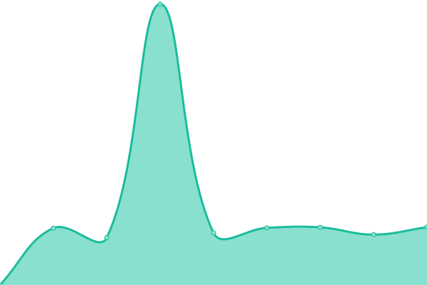

# [📈 Live Status](https://Jeremias85.github.io/monitor-web): <!--live status--> **🟩 All systems operational**

This repository contains the open-source uptime monitor and status page for [Jeremias85](https://Jeremias85.github.io/monitor-web), powered by [Upptime](https://github.com/upptime/upptime).

With [Upptime](https://upptime.js.org), you can get your own unlimited and free uptime monitor and status page, powered entirely by a GitHub repository. We use [Issues](https://github.com/Jeremias85/monitor-web/issues) as incident reports, [Actions](https://github.com/Jeremias85/monitor-web/actions) as uptime monitors, and [Pages](https://Jeremias85.github.io/monitor-web) for the status page.

<!--start: status pages-->
<!-- This summary is generated by Upptime (https://github.com/upptime/upptime) -->
<!-- Do not edit this manually, your changes will be overwritten -->
<!-- prettier-ignore -->
| URL | Status | History | Response Time | Uptime |
| --- | ------ | ------- | ------------- | ------ |
|  [USW Gestión](https://uswgestion.com) | 🟩 Up | [usw-gestion.yml](https://github.com/Jeremias85/monitor-web/commits/HEAD/history/usw-gestion.yml) | 

 1162ms
     
 | 

<a href="https://Jeremias85.github.io/monitor-web/history/usw-gestion">100.00%</a>
    

|  [App administrativa Concejo Deliberante de Ushuaia](http://waia.uswgestion.com) | 🟩 Up | [app-administrativa-concejo-deliberante-de-ushuaia.yml](https://github.com/Jeremias85/monitor-web/commits/HEAD/history/app-administrativa-concejo-deliberante-de-ushuaia.yml) | 

 693ms
     
 | 

<a href="https://Jeremias85.github.io/monitor-web/history/app-administrativa-concejo-deliberante-de-ushuaia">100.00%</a>
    

|  [Moodle USW Gestión](http://educacion.uswgestion.com) | 🟩 Up | [moodle-usw-gestion.yml](https://github.com/Jeremias85/monitor-web/commits/HEAD/history/moodle-usw-gestion.yml) | 

 1362ms
     
 | 

<a href="https://Jeremias85.github.io/monitor-web/history/moodle-usw-gestion">100.00%</a>
    

|  [Concejo Deliberante AR](https://concejodeliberante.ar) | 🟩 Up | [concejo-deliberante-ar.yml](https://github.com/Jeremias85/monitor-web/commits/HEAD/history/concejo-deliberante-ar.yml) | 

 1258ms
     
 | 

<a href="https://Jeremias85.github.io/monitor-web/history/concejo-deliberante-ar">100.00%</a>
    

|  [Ventanilla legislativa Concejo Deliberante AR](https://legislacion.concejodeliberante.ar) | 🟩 Up | [ventanilla-legislativa-concejo-deliberante-ar.yml](https://github.com/Jeremias85/monitor-web/commits/HEAD/history/ventanilla-legislativa-concejo-deliberante-ar.yml) | 

 912ms
     
 | 

<a href="https://Jeremias85.github.io/monitor-web/history/ventanilla-legislativa-concejo-deliberante-ar">100.00%</a>
    

|  [Página web Hostería Valle Frío Ushuaia](https://vallefrioushuaia.com/) | 🟩 Up | [pagina-web-hosteria-valle-frio-ushuaia.yml](https://github.com/Jeremias85/monitor-web/commits/HEAD/history/pagina-web-hosteria-valle-frio-ushuaia.yml) | 

 1251ms
     
 | 

<a href="https://Jeremias85.github.io/monitor-web/history/pagina-web-hosteria-valle-frio-ushuaia">99.84%</a>
    

<!--end: status pages-->

[**Visit our status website →**](https://Jeremias85.github.io/monitor-web)

## 📄 License

- Powered by: [Upptime](https://github.com/upptime/upptime)
- Code: [MIT](./LICENSE) © [Jeremias85](https://Jeremias85.github.io/monitor-web)
- Data in the `./history` directory: [Open Database License](https://opendatacommons.org/licenses/odbl/1-0/)
